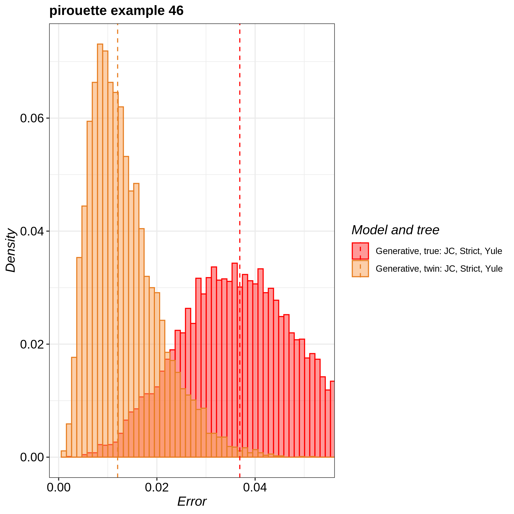

# pirouette_example_46

Branch   |[](https://travis-ci.com)                                                                                                 |[](https://appveyor.com)                                                                                               
---------|--------------------------------------------------------------------------------------------------------------------------------------------------------------|---------------------------------------------------------------------------------------------------------------------
`master` |[](https://travis-ci.com/richelbilderbeek/pirouette_example_46) |.
`develop`|[](https://travis-ci.com/richelbilderbeek/pirouette_example_46)|.

A [pirouette example](https://github.com/richelbilderbeek/pirouette_examples):
use one exemplary DD tree, as used in the pirouette article,
without the use of candidate models.

## Running on Peregrine

Install `pirouette` using the [peregrine](https://github.com/richelbilderbeek/peregrine)
bash and R scripts.

Then, in the main folder of this repo, type:

```
sbatch scripts/rerun.sh
```

## Related settings

 * [Multiple DD trees](https://github.com/richelbilderbeek/pirouette_example_28)

## Results

 * Download the intermediate data at 
   [https://www.richelbilderbeek.nl/pirouette_example_46.zip](https://www.richelbilderbeek.nl/pirouette_example_46.zip)



